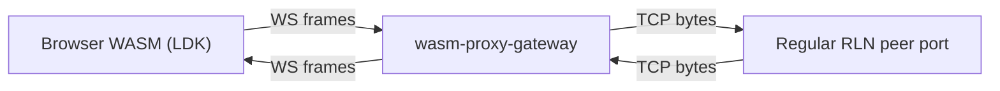
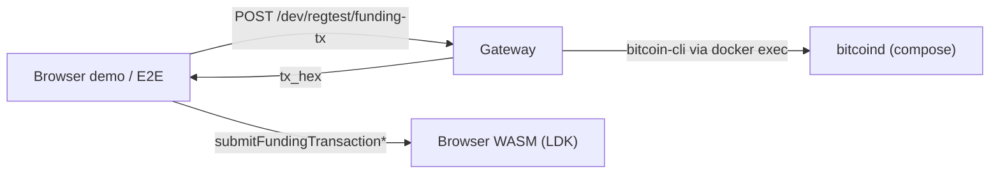

# WASM architecture (RLN)

This document is the **canonical architecture reference** for the WASM-related stack in this repository:

- **WASM SDK crate**: `bindings/wasm-sdk` (browser-facing `wasm-bindgen` SDK)
- **WS↔TCP gateway + dev helpers**: `tools/wasm-proxy-gateway`
- **Browser E2E**: `bindings/wasm-sdk/e2e-specs` + `scripts/ci/wasm_regular_rln_e2e.sh`
- **Shared contracts**: the `sdk-contracts` crate (git dependency; types + stable error strings)

## Components

### Browser (WASM runtime)

- **LDK runs in WASM** (peer/channel/payment state machine is local to the browser runtime).
- **State persistence**: runtime state is persisted in browser storage and is reload-safe.
- **Public JS API**: exposed via `wasm-pack` output from `bindings/wasm-sdk`.

Key files:

- Entry exports and lifecycle gates: `bindings/wasm-sdk/src/lib.rs`
- Node runtime surface: `bindings/wasm-sdk/src/ln_node.rs`
- WS transport (including replay cursor): `bindings/wasm-sdk/src/ln_transport.rs`
- Persistence: `bindings/wasm-sdk/src/runtime_store.rs`, `bindings/wasm-sdk/src/wasm_node_persistence.rs`

### Gateway (host-side)

The gateway provides:

1. **LN transport bridge**: browser WebSocket ↔ gateway ↔ TCP peer port on a regular RLN.
2. **RGB JSON-RPC pass-through**: `/rgb/json-rpc` forwards to the configured upstream.
3. **Dev helpers (regtest)**: funding tx + selected regular-RLN REST proxy routes used by demos/E2E.

Key file:

- `tools/wasm-proxy-gateway/src/main.rs`

Important properties:

- **Replay support** is best-effort transport reliability for reconnect/reload scenarios.
- **Target policy** defaults to localhost/private-only unless explicitly allowed.

### Regular RLN (native)

- Runs as a normal `rgb-lightning-node` instance (REST + LDK peer TCP port).
- In E2E, it can be auto-provisioned by the orchestration script.

## Data flows

### LN byte relay (happy path)



### Funding (regtest dev flow)



## Contracts

- **Shared contract types + stable error strings** live in the `sdk-contracts` crate,
  consumed as a git dependency (see `bindings/wasm-sdk/Cargo.toml`).

## How to run

- **Canonical one-liner (matches CI intent)**:

```bash
E2E_AUTO_PROVISION_REGULAR_RLN=1 ./scripts/ci/wasm_regular_rln_e2e.sh
```

- See:
  - `bindings/wasm-sdk/README.md` (local env and examples)
  - `bindings/wasm-sdk/e2e-specs/README.md` (Playwright scenarios and ports)

