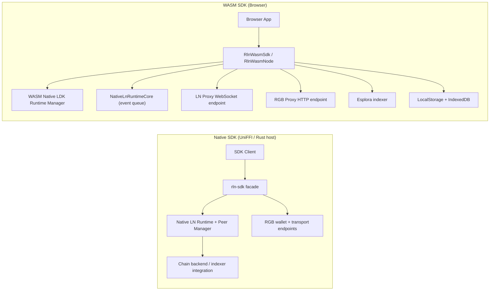
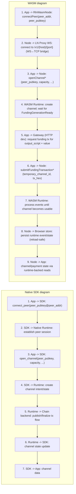
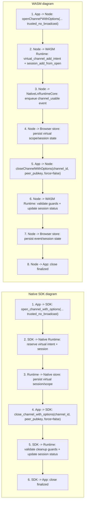
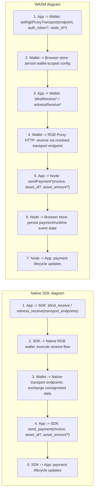
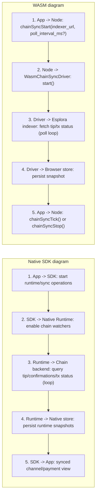

# SDK vs WASM Architecture (UML)

This document compares the native SDK model with the browser WASM model.

## 1) Component Comparison

## 2) Open Channel Flow Comparison

## 3) Virtual Channel Flow Comparison

## 4) RGB-over-LN Flow Comparison

## 5) Chain Sync Flow Comparison

